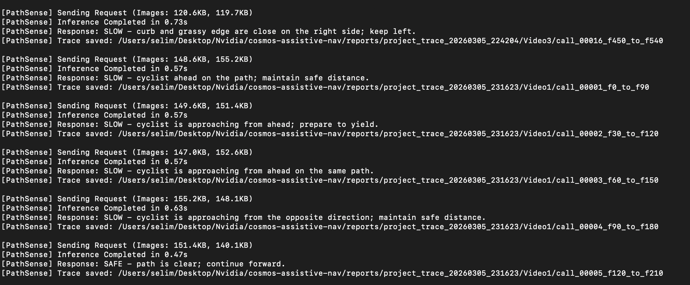
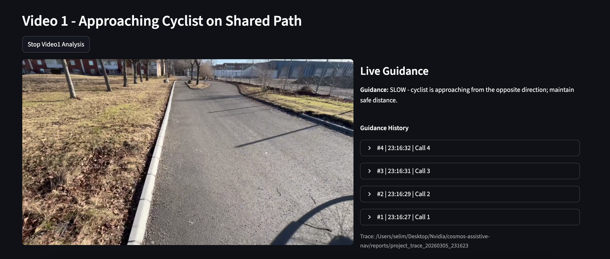

# PathSense: Vision Reasoning for Assistive Navigation

PathSense is a vision-reasoning prototype designed to assist blind and visually impaired pedestrians by identifying potential hazards on walking paths and producing simple safety actions.

The system uses NVIDIA Cosmos Reason 2, a reasoning-focused vision-language model, to analyze short temporal windows of egocentric video and infer risks such as approaching cyclists, path edges, or terrain changes.

Instead of generating long descriptions of the environment, PathSense outputs simple safety signals that can later be converted into haptic or audio feedback.

This project was created for the [NVIDIA Cosmos Cookoff](https://luma.com/nvidia-cosmos-cookoff), a virtual challenge centered on building real-world physical AI applications with Cosmos models. The event requires a public repository and deployment instructions, so this README documents both the project and how to run it.

## Project Overview

Navigating urban environments without sight requires constant awareness of hazards such as curbs, slopes, obstacles, and moving objects. While tools like canes or guide dogs help detect nearby obstacles, they often provide feedback only when hazards are already very close.

PathSense explores how vision reasoning models can provide earlier awareness of environmental risks by analyzing the pedestrian's viewpoint.

The current prototype processes short frame windows captured from a chest-level or egocentric walking camera and determines the safest walking state.

## Action Space

PathSense is designed around simple, interpretable action outputs:

- `SAFE`
- `SLOW`
- `STOP`
- `EDGE_LEFT`
- `EDGE_RIGHT`

These outputs are intended to map cleanly to assistive feedback such as vibration patterns or spoken audio cues.

Current implementation note:

- The live Streamlit demo in this repository currently normalizes model responses to `SAFE`, `SLOW`, or `STOP`.
- Boundary conditions such as curbs and edges are still part of the reasoning task, but in the current app they are surfaced through short guidance text rather than dedicated `EDGE_LEFT` / `EDGE_RIGHT` action codes.

## NVIDIA Cosmos Cookoff

PathSense was developed for the NVIDIA Cosmos Cookoff, a virtual developer challenge focused on using Cosmos models for real-world physical AI problems.

The Cookoff encourages developers to build applications around robotics, autonomous systems, video intelligence, and embodied reasoning. PathSense applies those capabilities to assistive navigation for pedestrians.

## How It Works

The system follows a compact reasoning pipeline:

`Camera -> Frame Sampling -> Vision Reasoning -> Safety Action`

### 1. Egocentric Video Input

A camera mounted near the pedestrian's chest records the walking path from an egocentric perspective.

### 2. Temporal Frame Comparison

Two frames are sent to the model:

- Previous frame
- Current frame

In the current demo implementation, the previous frame is approximately 3 seconds earlier than the current frame, and the app attempts a new call roughly once per second.

By comparing the two frames, the model can reason about:

- approaching objects
- path structure
- terrain changes
- spatial boundaries

### 3. Vision Reasoning with Cosmos

Cosmos Reason 2 analyzes the frames and identifies hazards that affect the pedestrian's walking path.

Rather than describing the entire scene, the model is prompted to produce a short safety-oriented decision.

### 4. Action Output

Conceptually, PathSense is designed around outputs such as:

- `SAFE - path is clear`
- `SLOW - caution required`
- `STOP - collision risk ahead`
- `EDGE_LEFT - path edge close on the left`
- `EDGE_RIGHT - path edge close on the right`

In this repository's current UI, the model response is displayed as a single short guidance line such as:

- `SLOW - cyclist approaching on the path`
- `SLOW - curb and grassy edge are close on the right side; keep left`

## Demo Scenarios

PathSense was tested on three real walking situations:

### 1. Oncoming Cyclist

The model detects a cyclist approaching on the walking path and signals caution.

### 2. Sloped Path Transition

The system recognizes a change in terrain where the path splits and slopes downward and recommends caution.

### 3. Path Edge Proximity

When the pedestrian walks close to a curb or edge, the system warns about the boundary risk.

## Key Ideas

PathSense demonstrates three types of navigation reasoning:

### Dynamic Hazards

Understanding moving objects such as cyclists or pedestrians.

### Terrain Awareness

Detecting slopes or structural changes in the walking path.

### Spatial Boundaries

Recognizing edges, curbs, and path borders that may cause trips or falls.

## Current Repository Structure

```text
app/
  main.py                  # Streamlit UI
core/
  cosmos_client.py         # NVIDIA Cosmos API client
  frame_sampler.py         # Two-frame preprocessing entry point
  worker.py                # Background inference worker
utils/
  image_utils.py           # Resize + JPEG + base64 preprocessing
videos/
  Video1.mp4
  Video2.mp4
  Video3.mp4
presentation/
  presentation.html        # Slide deck used for the project presentation
  problem.png
  solution.png
reports/
  project_trace_*/...      # Saved request/response artifacts per run
```

## Technologies Used

- NVIDIA Cosmos Reason 2
- Python
- Streamlit
- OpenCV
- Requests
- Vision-language model inference
- Egocentric video processing

## Local Setup

### Prerequisites

- Python 3.9 or newer
- Access to an NVIDIA Cosmos Reason 2 endpoint
- Three demo videos placed under `videos/` as:
  - `Video1.mp4`
  - `Video2.mp4`
  - `Video3.mp4`

### 1. Create a virtual environment

```bash
python3 -m venv .venv
source .venv/bin/activate
```

### 2. Install dependencies

```bash
pip install -r requirements.txt
```

### 3. Configure environment variables

PathSense expects a Cosmos chat completions endpoint.

```bash
export COSMOS_ENDPOINT="https://your-endpoint.example.com/v1/chat/completions"
export COSMOS_MODEL="nvidia/Cosmos-Reason2-8B"
```

Notes:

- `COSMOS_ENDPOINT` should point to the full chat completions endpoint.
- `COSMOS_MODEL` is optional. If unset, the app defaults to `nvidia/Cosmos-Reason2-8B`.

### 4. Run the app locally

```bash
streamlit run app/main.py
```

Then open the local URL shown by Streamlit, usually:

```text
http://localhost:8501
```

## Deployment Instructions

This project is easiest to deploy on a Linux VM or cloud instance that can reach your Cosmos endpoint.

### Option 1. Simple VM deployment

1. Clone the repository onto the server.
2. Create and activate a Python virtual environment.
3. Install dependencies with `pip install -r requirements.txt`.
4. Export `COSMOS_ENDPOINT` and optionally `COSMOS_MODEL`.
5. Place the demo videos into the `videos/` directory.
6. Start Streamlit with a public bind address:

```bash
streamlit run app/main.py --server.address 0.0.0.0 --server.port 8501
```

7. Expose port `8501` in your firewall or put the service behind a reverse proxy.

### Option 2. Persistent deployment with systemd

Create a service file such as `/etc/systemd/system/pathsense.service`:

```ini
[Unit]
Description=PathSense Streamlit App
After=network.target

[Service]
Type=simple
User=ubuntu
WorkingDirectory=/path/to/cosmos-assistive-nav
Environment=COSMOS_ENDPOINT=https://your-endpoint.example.com/v1/chat/completions
Environment=COSMOS_MODEL=nvidia/Cosmos-Reason2-8B
ExecStart=/path/to/cosmos-assistive-nav/.venv/bin/streamlit run app/main.py --server.address 0.0.0.0 --server.port 8501
Restart=always
RestartSec=5

[Install]
WantedBy=multi-user.target
```

Then enable and start it:

```bash
sudo systemctl daemon-reload
sudo systemctl enable pathsense
sudo systemctl start pathsense
```

To inspect logs:

```bash
sudo journalctl -u pathsense -f
```

### Optional reverse proxy

For a cleaner public URL, place Streamlit behind Nginx or another reverse proxy and forward traffic to `localhost:8501`.

## Running the Demo

Once the app is open:

1. Choose one of the three demo videos.
2. Click `Run VideoX Analysis`.
3. The app buffers the first 3-second window.
4. Each inference sends two frames to the model.
5. The UI displays a short guidance line and keeps prior responses in an expandable history panel.

## Trace and Debug Artifacts

Each run writes detailed trace files under `reports/project_trace_<timestamp>/`.

Per call, the app saves:

- the exact frames sent to the model
- request metadata
- the full request payload
- the raw model response
- the normalized parsed response
- the full API response body

This makes it easy to inspect exactly what the model saw and how the system interpreted the result.

## Example Output

Example model outputs in this project:

```text
SLOW - cyclist approaching on the path
```

```text
SLOW - curb and grassy edge are close on the right side; keep left
```

This design prioritizes short, interpretable safety signals instead of verbose scene descriptions.

## Demo Preview




## Future Work

Possible extensions include:

- real-time streaming inference from a live camera
- integration with wearable assistive devices
- broader action vocabulary such as explicit `EDGE_LEFT` / `EDGE_RIGHT`
- multi-frame temporal reasoning
- improved hazard prioritization and smoothing

## Acknowledgements

This project was created for the [NVIDIA Cosmos Cookoff](https://luma.com/nvidia-cosmos-cookoff), a developer challenge exploring real-world applications of Cosmos models in robotics, vision AI, and autonomous systems.
